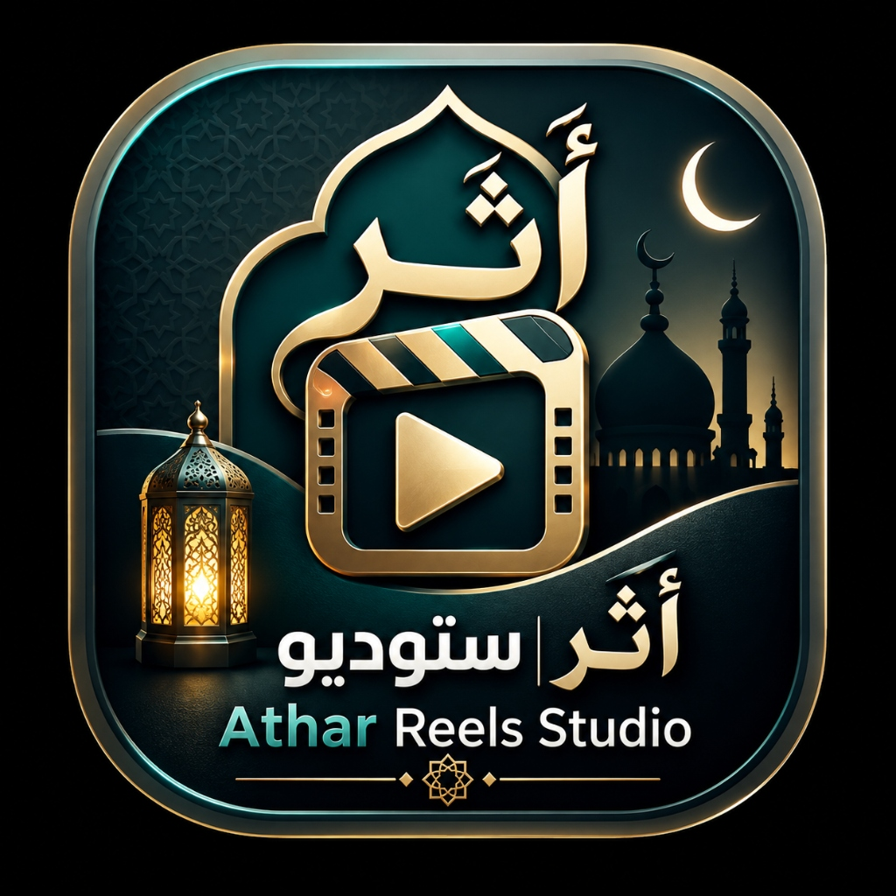

# 🌟 أَثَــر ستوديو | Athar Reels Studio (2026)

<div align="center">
  
  <h3>المنصة الاحترافية الأولى لإنتاج الريلز والفيديوهات القرآنية الفيروسية</h3>
  <p><em>﴿إِنَّا نَحْنُ نُحْيِي الْمَوْتَىٰ وَنَكْتُبُ مَا قَدَّمُوا وَآثَارَهُمْ﴾</em></p>
  <p><strong>صدقة جارية عن الوالدة تيجاني عائشة (رحمها الله وغفر لها وأسكنها الفردوس الأعلى)</strong></p>
</div>

---

## 📖 حول المشروع (About)

**أَثَــر ستوديو (Athar Reels Studio)** هو تطبيق ديسكتوب وويب متطور ومصمم خصيصاً لصناع المحتوى الإسلامي والقرآني لإنتاج فيديوهات ريلز وقصص (Reels, TikTok, YouTube Shorts) بأعلى جودة بصرية وتصميم سينمائي مبتكر بنقرة زر واحدة.

---

## ✨ المميزات الرئيسية (Key Features)

- 🔥 **صانع الريلز الفيروسي 2026**: قوالب عمودية (9:16) ومربعة (1:1) وأفقية (16:9) مهيأة لخوارزميات منصات التواصل الاجتماعي.
- 🎙️ **مكتبة كبار القراء (80+ قارئ)**: تلاوات قرآنية خاشعة ومصاحف كاملة (ياسر الدوسري، إسلام صبحي، عبد الرحمن مسعد، شريف مصطفى، أئمة الحرمين، ورش، وحفص).
- 📿 **تزامن الكاريوكي الفائق (Karaoke Word-Highlighting)**: تظليل الكلمات كلمة بكلمة مع التلاوة بدقة متناهية مع موجات صوتية نابضة (Waveforms).
- 🌍 **الترجمة الفورية لـ 6 لغات عالمية**: إنجليزية، فرنسية، أوردو، تركية، إسبانية، وإندونيسية.
- 🎧 **استوديو الصوت ثلاثي الأبعاد 8D**: دمج صدى الحرم والمساجد الكبرى مع أصوات الطبيعة الهادئة (مطر، بحر، نسيم، عصافير).
- 🎬 **تصدير فوري 4K و 1080p بمحرك FFmpeg**: ريندر محلي فائق السرعة وبدون علامات مائية إجبارية.
- 🤖 **مولد الكابشن والهاشتاجات الذكي**: توليد نصوص النشر والهاشتاجات المتصدرة بنقرة زر.
- 🧭 **جولة إرشادية تفاعلية ذكية (Spotlight Tour)**: إرشاد المستخدمين الجدد خطوة بخطوة للتعرف على الأدوات.

---

## 🛠️ التقنيات المستخدمة (Tech Stack)

- **Frontend**: React 18, TypeScript, TailwindCSS, Framer Motion, Lucide Icons.
- **State Management**: Zustand.
- **Desktop Runtime**: Electron 33, Vite 6, `vite-plugin-electron`.
- **Rendering & Audio Engine**: Web Audio API, Web Spatial 8D Panner, FFmpeg / Fluent-FFmpeg.
- **TTS Engine**: Microsoft Edge Neural Arabic TTS (`msedge-tts`).
- **Data APIs**: Quran.com API v4, Al-Quran Cloud, Hadith-API, Pexels API.

---

## 🚀 التشغيل والتطوير المحلي (Quick Start)

### المتطلبات:
- Node.js >= 18.0.0
- npm >= 9.0.0

### التثبيت والتشغيل:
```bash
# 1. تثبيت الحزم
npm install

# 2. تشغيل بيئة الويب (Vite Dev Server)
npm run dev

# 3. تشغيل تطبيق Electron Desktop للتطوير
npm run electron:dev

# 4. بناء نسخة الإنتاج والتوزيع (Installer Setup)
npm run electron:build
```

---

## 🔒 الخصوصية والأمان (Privacy & Security)

- جميع المشاريع والبيانات والتسجيلات تُحفظ **محلياً على جهاز المستخدم** في مجلد `userData` الآمن.
- لا يتم إرسال أي بيانات شخصية إلى أي خادم خارجي.

---

## 🤲 إهداء وصدقة جارية (Dedication)

نسأل الله العلي القدير أن يتقبل هذا العمل خالصاً لوجهه الكريم، وأن يجعله صدقة جارية تضيء قبر الوالدة **تيجاني عائشة** ويمتد أجرها إلى يوم القيامة، وأن ينفع به كل من استمع أو نشر آية من كتاب الله.
